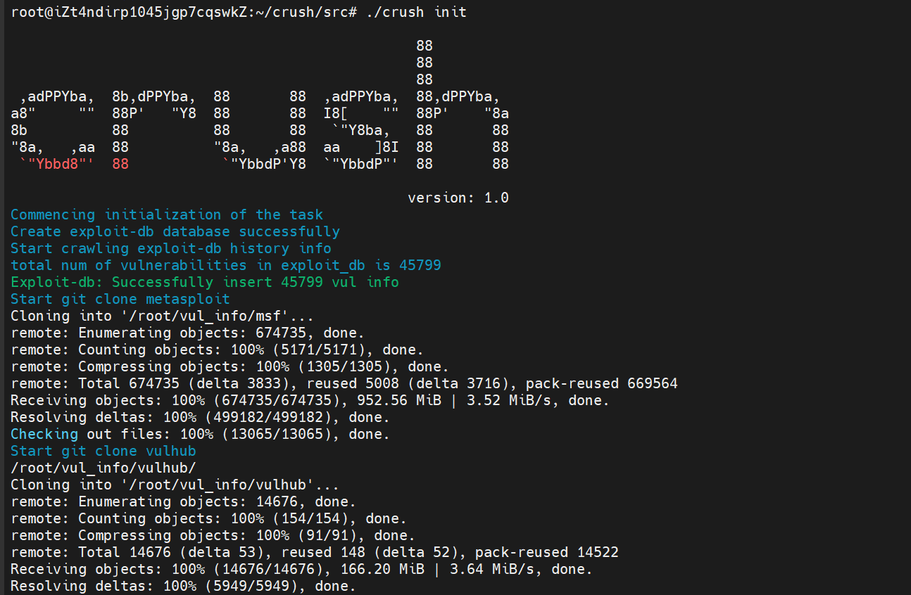
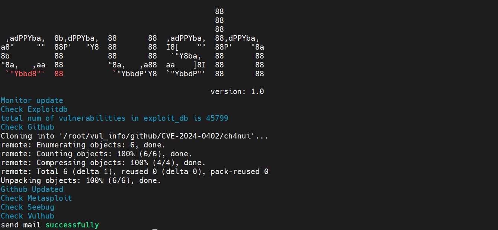
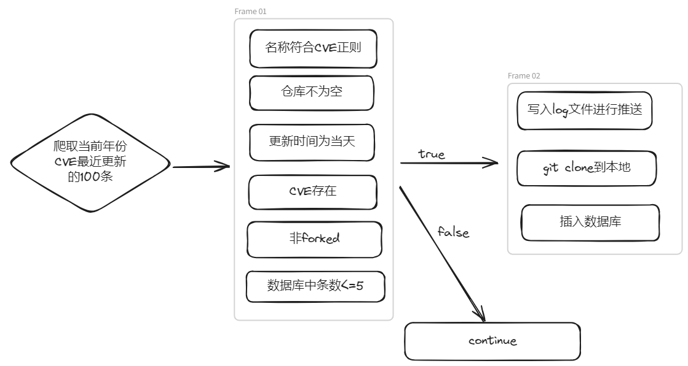
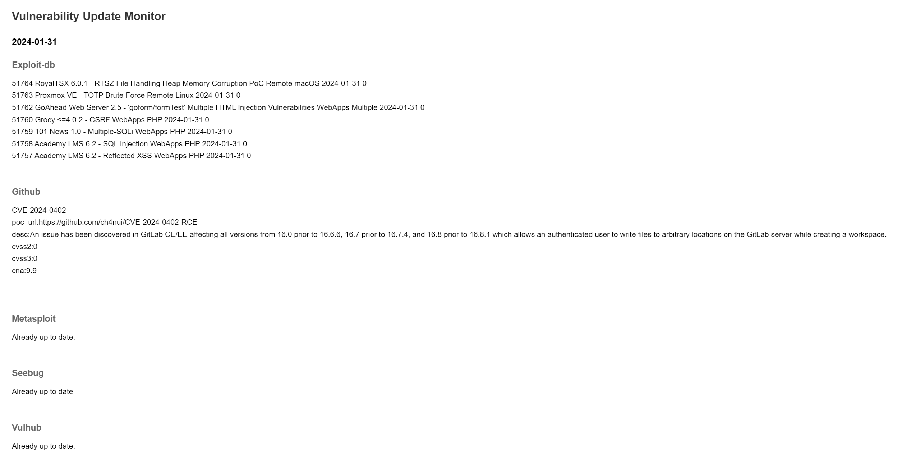
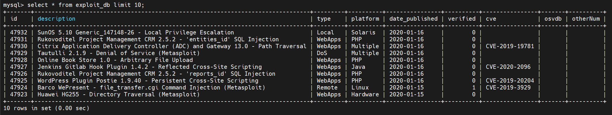
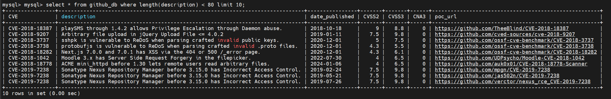
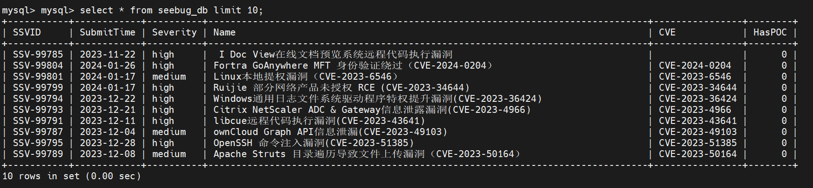
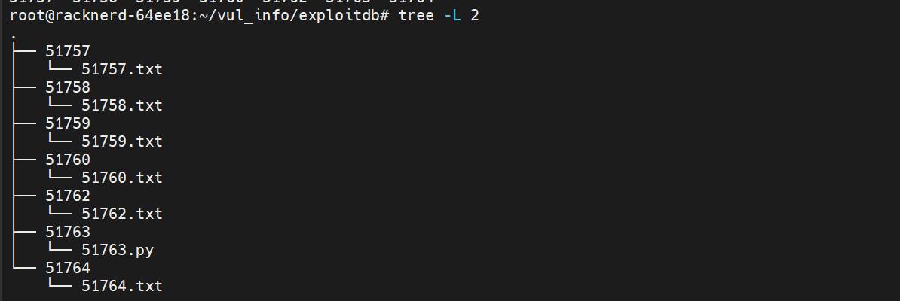
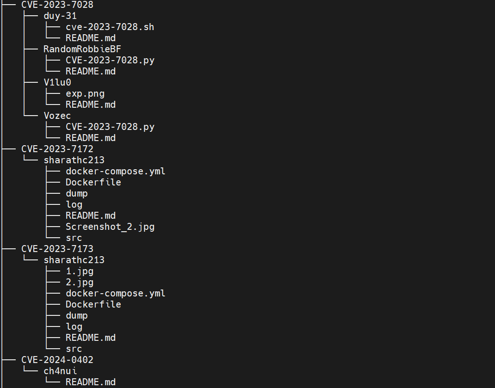

 

## CRUSH是一款漏洞监控工具，用来爬取历史数据并获取每日更新

```

                                                88
                                                88
                                                88
 ,adPPYba,  8b,dPPYba,  88       88  ,adPPYba,  88,dPPYba,
a8"     ""  88P'   "Y8  88       88  I8[    ""  88P'    "8a
8b          88          88       88   `"Y8ba,   88       88
"8a,   ,aa  88          "8a,   ,a88  aa    ]8I  88       88
 `"Ybbd8"'  88           `"YbbdP'Y8  `"YbbdP"'  88       88


```
## 功能

* [x] 爬取exploit-db历史数据并监控更新
* [x] 爬取seebug漏洞库历史数据并监控更新
* [x] 监控metasploit每日更新
* [x] 监控vulhub每日更新
* [x] 监控github每日更新
* [x] github历史poc存档
* [x] exploit-db历史poc存档
* [x] 每日更新数据通过邮件推送
* [ ] ~~代码优化-----能跑就行 : )~~

## 安装

工具只能在linux上运行，建议为海外VPS，防止出现github等连接不通的情况。

### Go

- [Go](https://go.dev/) version 1.20 或以上版本.

**Github**

```bash
git clone https://github.com/leesinz/crush.git
cd crush/src
go build
./crush   or go run main.go
```

## 配置

#### config.yml

```yaml
database:
  db_username: ""      // 数据库 username
  db_password: ""      // 数据库 password
  name: ""             // 数据库名

github:
  github_token: ghp_xxx                        // github token，利用 token 提高 API 访问次数
  start_year: 2018     # from CVE-[start_year] // 如果爬取 GitHub 信息，指从 start_year 开始爬取
  end_year: 2023       # till CVE-[end_year]   // 如果爬取 GitHub 信息，指爬取到 end_year 为止
  poc_dir: "/root/vul_info/github/"            // github 上爬取到的 poc 保存地址
  blacklist:                                   // github 用户黑名单
    - xxx
    - aaa

msf:
  msf_dir: "/root/vul_info/msf/"               // metasploit git clone 到本地的地址

vulhub:
  vulhub_dir: "/root/vul_info/vulhub/"         // vulhub git clone 到本地的地址

exploitdb:
  exploitdb_dir: "/root/vul_info/exploitdb/"   // exploit-db poc 本地存放地址

email:                                          // 推送邮件配置
  smtp_server: smtp.163.com                     // smtp 服务器地址
  smtp_port: 25                                 // smtp 端口
  username:                                     // 发件人用户名
  password:                                     // 发件人密码（授权码）
  from:                                         // 发件人用户名
  to:                                           // 收件人列表
    - test1@163.com
    - test2@163.com

```

#### mysql配置

```
sudo apt-get update
sudo apt-get install mysql-server
sudo mysql_secure_installation
```

设置密码并创建数据库，将配置信息同步到config.yml。

如果遇到

`Error connecting mysql database:%!(EXTRA *mysql.MySQLError=Error 1698 (28000): Access denied for user 'root'@'localhost', string=)`

重置密码即可：

`ALTER USER 'root'@'localhost' IDENTIFIED WITH mysql_native_password BY 'newpasswd';`

#### 安装google-chrome

```bash
wget https://dl.google.com/linux/direct/google-chrome-stable_current_amd64.deb
sudo apt install ./google-chrome-stable_current_amd64.deb
```

显示版本号即为安装成功，如下：

```bash
root@iZt4ndirp1045jgp7cqswkZ:~# google-chrome -version
Google Chrome 121.0.6167.139
```

#### 使用方法

初次使用时，先使用 init 参数，进行历史数据爬取，数据库创建等操作，后续直接使用 monitor 参数即可，会监控每天更新内容并通过邮件进行推送。





crontab请自行配置，代码中未设置定时任务或循环等。

## 匹配逻辑

#### github



#### metasploit&vulhub


## Else...

**exploit-db**

爬取历史poc时速率太快会被封，截止2024-1-31所有历史poc数据已爬取打包到pocs目录下。

**github**

github api访问有速率限制，爬取了CVE-2018-2023的历史数据，经过筛选处理后，存档到本地，详见pocs目录。

**seebug**

加速乐反爬，该项目通过webdriver进行爬取，如需历史数据见sql文件夹。


#### 导入方式

exploit-db，seebug，github的数据库文件均见sql文件夹（截止到2024-1-31的数据）。

mysql -u username -p database_name < /path/to/your/file.sql

#### 运行结果示例



#### 数据库结构展示

**exploit-db**



**github**



**seebug**




#### poc结构展示

**exploit-db**

数字即为漏洞编号，与官网、数据库中相对应。



**github**

github poc文件夹名称为CVE号，并且以作者名命名不超过5个子文件夹来保存poc信息。



## 鸣谢

感谢以下优秀的项目：

[github_cve_monitor](https://github.com/yhy0/github-cve-monitor)

## 免责声明

本工具仅能在取得足够合法授权的企业安全建设中使用，在使用本工具过程中，您应确保自己所有行为符合当地的法律法规。 
如您在使用本工具的过程中存在任何非法行为，您将自行承担所有后果，本工具所有开发者和所有贡献者不承担任何法律及连带责任。
除非您已充分阅读、完全理解并接受本协议所有条款，否则，请您不要安装并使用本工具。
您的使用行为或者您以其他任何明示或者默示方式表示接受本协议的，即视为您已阅读并同意本协议的约束。


.jpg)
