 

## CRUSH是一款漏洞监控工具，用来监控每日漏洞更新并通过邮件推送

```

                                                88
                                                88
                                                88
 ,adPPYba,  8b,dPPYba,  88       88  ,adPPYba,  88,dPPYba,
a8"     ""  88P'   "Y8  88       88  I8[    ""  88P'    "8a
8b          88          88       88   `"Y8ba,   88       88
"8a,   ,aa  88          "8a,   ,a88  aa    ]8I  88       88
 `"Ybbd8"'  88           `"YbbdP'Y8  `"YbbdP"'  88       88


```
## 🎯功能

监控多个漏洞平台每日更新，将数据存储到本地数据库，并通过邮件进行推送。

### 漏洞源

* [x] [Exploit-db](https://www.exploit-db.com)
* [x] [Vulhub](https://github.com/vulhub/vulhub)
* [x] [Github](https://github.com/)
* [x] [Seebug](https://www.seebug.org/vuldb/vulnerabilities?page=1)
* [x] [Metasploit](https://github.com/rapid7/metasploit-framework)
* [x] [0day.today](https://0day.today/)（V2.0新增）
* [x] [PacketStorm](https://packetstormsecurity.com/files/tags/exploit/)（V2.0新增）
* [x] [Nuclei](https://github.com/projectdiscovery/nuclei-templates)（V3.0新增）
* [x] [Afrog](https://github.com/zan8in/afrog)（V3.0新增）
* [x] [POC](https://github.com/wy876/POC)（V3.0新增）

## 🪄安装

工具只能在linux上运行，建议为海外VPS，防止出现github等连接不通的情况。

### Go

- [Go](https://go.dev/) version 1.20 或以上版本.

**Github**

```bash
git clone https://github.com/leesinz/crush.git
cd crush
go build
./crush OR go run crush.go
```

## 🔧配置

#### config.yaml

```yaml
database:
  db_port: 3306
  db_username: "root"
  db_password: ""
  name: ""


#If downloadPOC is set to false, the poc_dir parameter in GitHub, ExploitDB, and PacketStorm does not need to be configured
poc:
  downloadPOC: false							                         #whether to download poc

github:
  github_token: ghp_xxx
  poc_dir: "/root/vul_info/poc/github/"			          #dir for GitHub PoCs
  blacklist:									#github blacklist users
    - xxx
    - aaa

exploitdb:
  poc_dir: "/root/vul_info/poc/exploitdb/"		        #dir for exploit-db PoCs

packetstorm:
  poc_dir: "/root/vul_info/poc/packetstorm/"	       #dir for packetstorm PoCs

email:
  smtp_server: smtp.163.com
  smtp_port: 25
  username: test@163.com
  password: xxx									                            #authentication code
  from: test@163.com
  to:
    - test1@163.com
    - test2@163.com

```

#### mysql配置

```
sudo apt-get update
sudo apt-get install mysql-server
sudo mysql_secure_installation
```

设置密码并创建数据库，将配置信息同步到config.yaml。

如果遇到

`Error connecting mysql database:%!(EXTRA *mysql.MySQLError=Error 1698 (28000): Access denied for user 'root'@'localhost', string=)`

重置密码即可：

`ALTER USER 'root'@'localhost' IDENTIFIED WITH mysql_native_password BY 'newpasswd';`

#### 安装google-chrome

```bash
wget https://dl.google.com/linux/direct/google-chrome-stable_current_amd64.deb
sudo apt install ./google-chrome-stable_current_amd64.deb
```

显示版本号即为安装成功，如下：

```bash
root@iZt4ndirp1045jgp7cqswkZ:~# google-chrome -version
Google Chrome 121.0.6167.139
```

#### 快速开始

##### 环境配置

- go环境
- mysql环境
- config.yaml配置
- google-chrome配置

配置完成后即可开始使用。

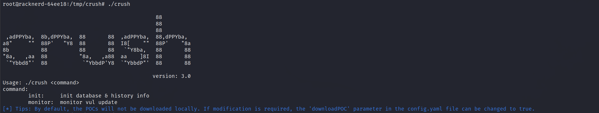

#####  初始化

初次使用时，先使用 init 参数，进行数据库创建，历史信息爬取等操作。

`./crush init`

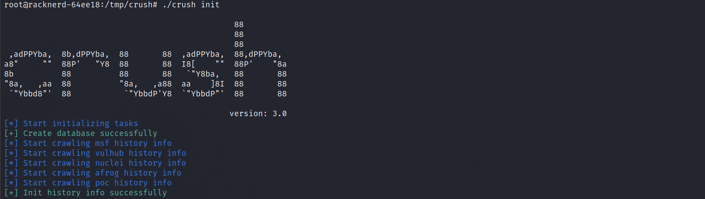

**注意配置config.yaml中的downloadPOC参数，如果设为false，不会下载poc文件，如果设为true，则需要配置config.yaml中github,exploit-db和packetstorm下的poc_dir参数，会将更新的poc文件存档到对应目录。**

##### 更新监控

在完成初始化后，后续使用monitor参数监控更新即可，会通过邮件将更新内容进行推送。

`./crush monitor`

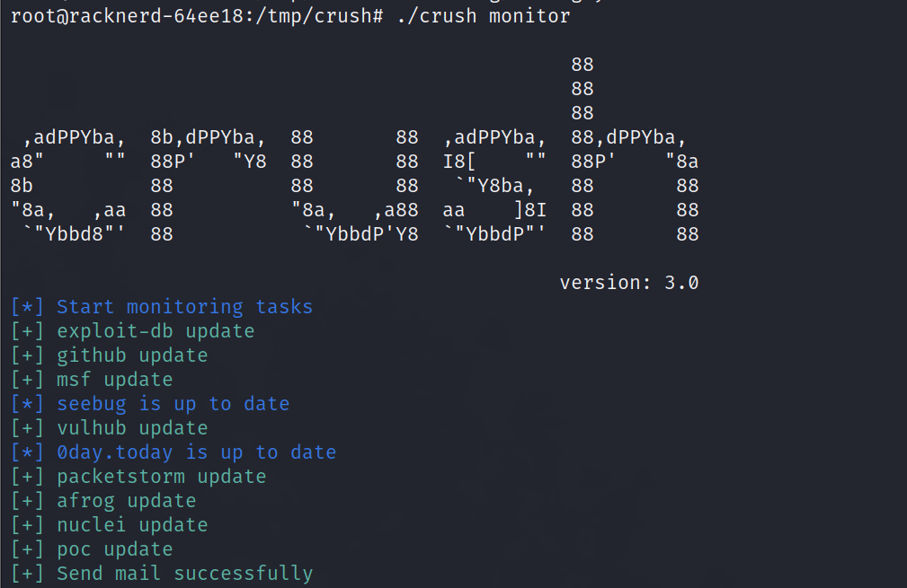

**crontab请自行配置，代码中未设置定时任务或循环等。**

例如：

`0 9 * * * cd [crush_path] && /usr/local/go/bin/go run crush.go monitor `

会在每天9点推送前一天的更新内容。

##### 导入历史数据（可选）

在V3.0版本中不再爬取历史数据，如果需要历史数据，可以直接通过.sql文件（存放在sql文件夹下）将历史数据导入数据库。

**exploit_db.sql,seebug.sql为全量历史数据，github.sql为2018至今的CVE数据，每个CVE最多五条。**

以exploit-db为例，命令如下：

`mysql -u username -p database_name < exploit_db.sql`

## 💡匹配逻辑

#### 整体结构

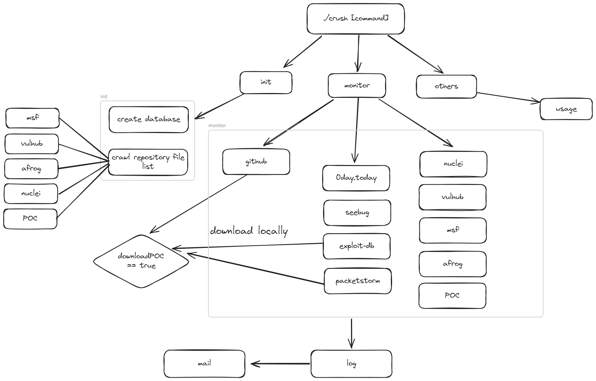

爬取逻辑分为3种，下面依次介绍。

#### github


#### 0day...

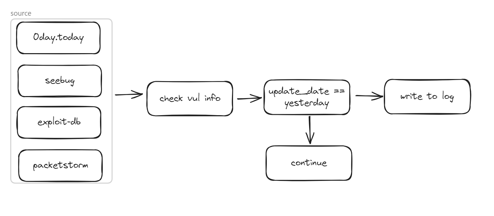

#### nuclei...

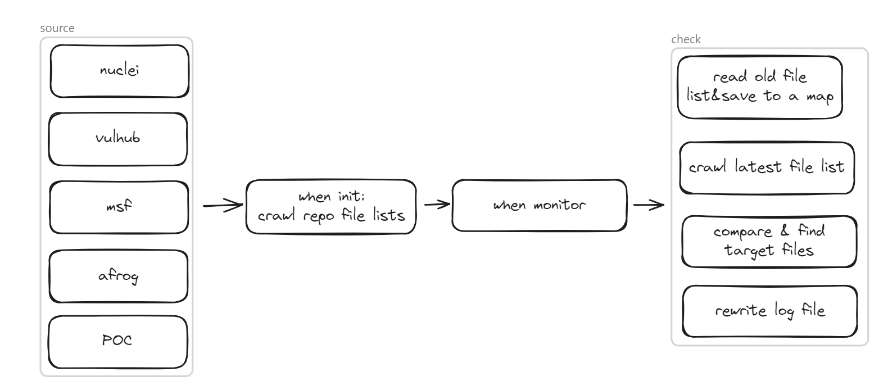


## 😎运行演示

#### 邮件模板

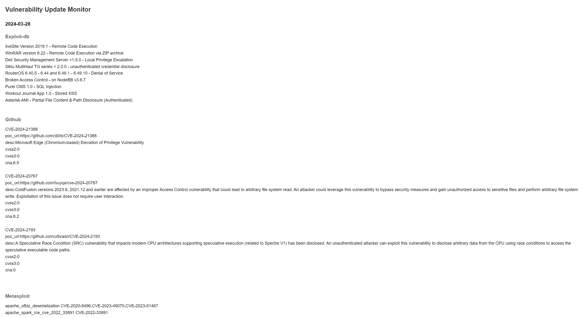

在V2.0的基础上新增了三个漏洞源：nuclei，POC和afrog。

github监控到的CVE漏洞，会展示CVE编号，poc地址，漏洞描述以及漏洞评分，其他源仅仅展示漏洞名称和CVE编号，如需poc地址信息，可前往对应漏洞平台或者去data目录下的jsonlog中查找。

#### 数据库结构

##### exploit-db

包含了edb官网存储的所有属性值：

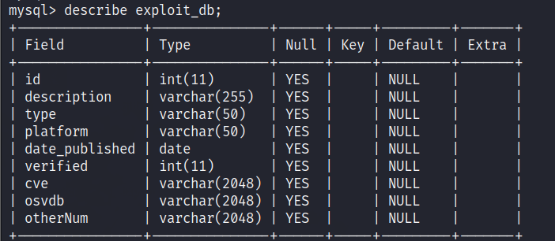

##### github

存储了CVE编号，nvd官网的漏洞描述，CVSS2,CVSS3,CNA评分，更新时间以及poc地址：

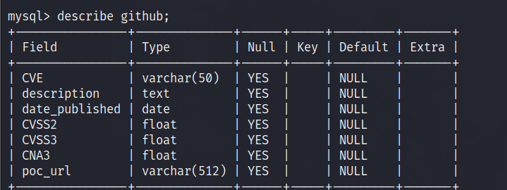

##### seebug

存储了官网ID，提交时间，漏洞严重程度，漏洞名称，CVE号以及是否有POC：


##### 0day.today

存储了官网ID，漏洞名称，CVE号，POC地址等信息：

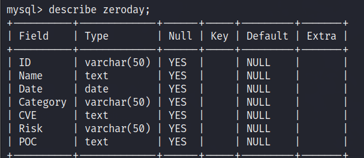

##### packetstorm

存储了官网ID，名称，CVE号，POC地址以及漏洞描述等等：

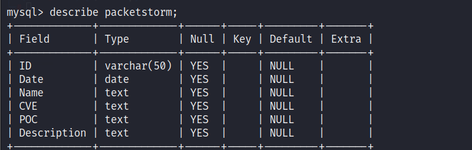

#### 日志文件

日志文件统一存放在data目录下：

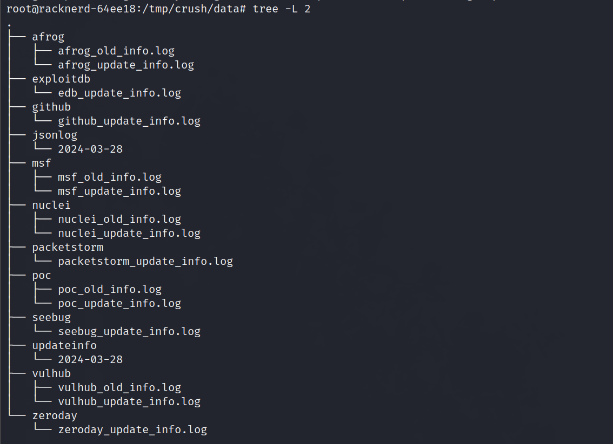

update_info.log存放对应漏洞源中每日更新情况：

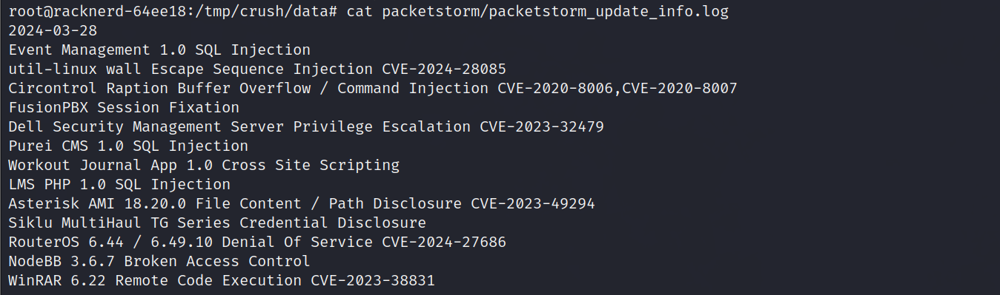

old_info.log中存放上次运行时，github仓库中的文件信息：

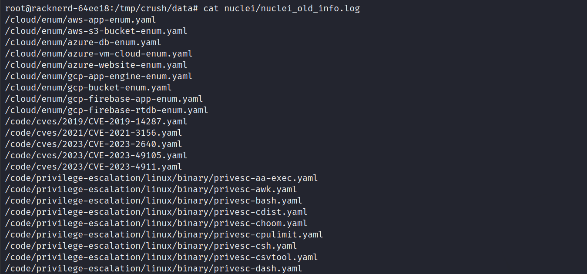

jsonlog目录下存放指定日期更新的所有poc信息：

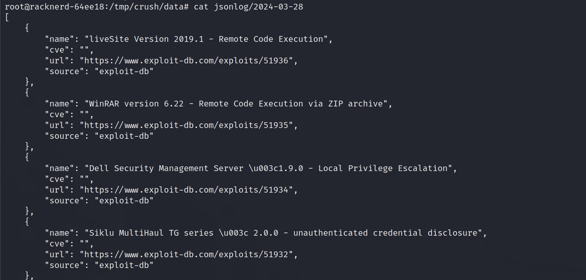

updateinfo目录下存放邮件内容（html格式）：

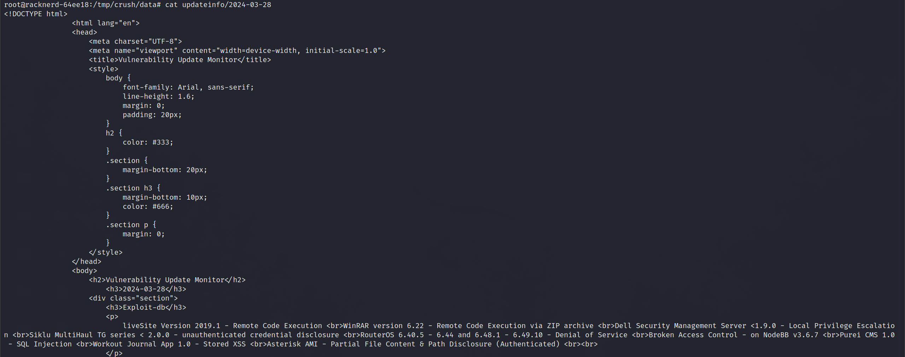

#### poc文件

开启downloadPOC之后，poc存档结构如下：

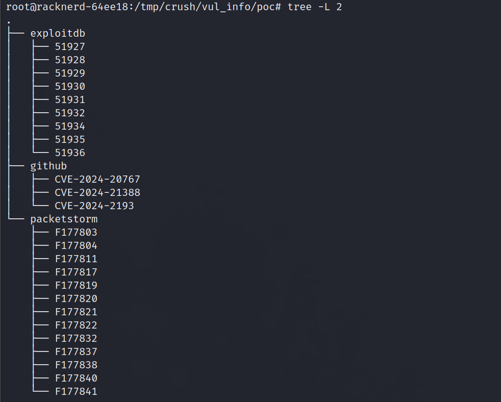

exploit-db和packetstorm目录以漏洞ID命名，github监控到的漏洞以CVE编号命名，如果同一漏洞有多个poc，则以作者名作为子文件夹名称。

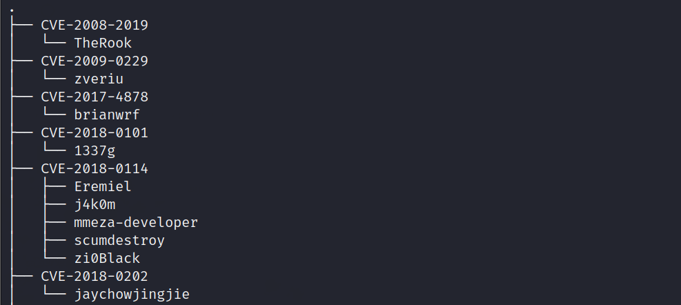

## 🎈版本更新

- 2024.02.05 V1.0 初始版本
- 2024.03.06 V2.0 新增0day.today和packetstorm漏洞源
- 2024.03.29 V3.0
  - 新增afrog，POC，nuclei漏洞源
  - 优化爬取方式，msf，vulhub，afrog，nuclei，POC漏洞源，从原来的git clone+git pull正则匹配的方式，改为使用github api进行contents遍历匹配，不需要将仓库存到本地，减轻存储压力
  - 添加了downloadPOC开关，可在config.yaml中配置，如果设为true，则需要配置config.yaml中github,exploit-db和packetstorm下的poc_dir参数，会将更新的poc文件存档到对应目录
  - 新增jsonlog日志文件，在data/jsonlog目录下，会以json格式记录更新的漏洞信息，包括漏洞名称，CVE编号，poc地址，漏洞来源等信息

## 🎉鸣谢

感谢以下优秀的项目：

[github_cve_monitor](https://github.com/yhy0/github-cve-monitor)

## 🕵️免责声明

本工具仅能在取得足够合法授权的企业安全建设中使用，在使用本工具过程中，您应确保自己所有行为符合当地的法律法规。 
如您在使用本工具的过程中存在任何非法行为，您将自行承担所有后果，本工具所有开发者和所有贡献者不承担任何法律及连带责任。
除非您已充分阅读、完全理解并接受本协议所有条款，否则，请您不要安装并使用本工具。
您的使用行为或者您以其他任何明示或者默示方式表示接受本协议的，即视为您已阅读并同意本协议的约束。

## ⭐Star History


