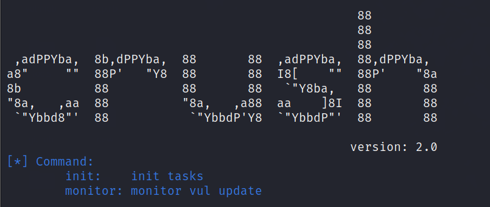
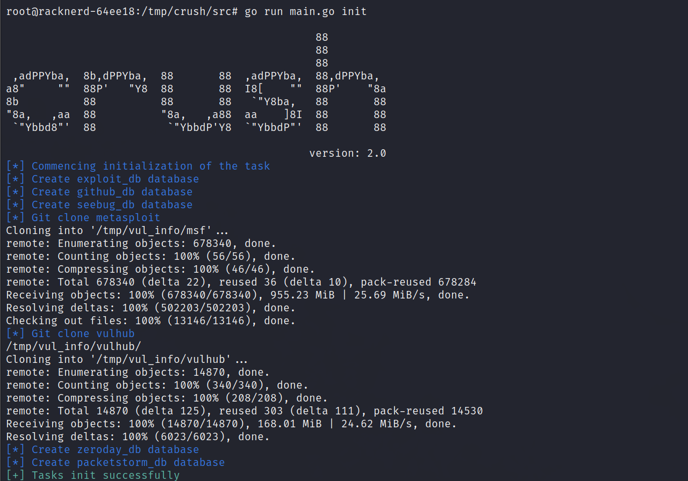
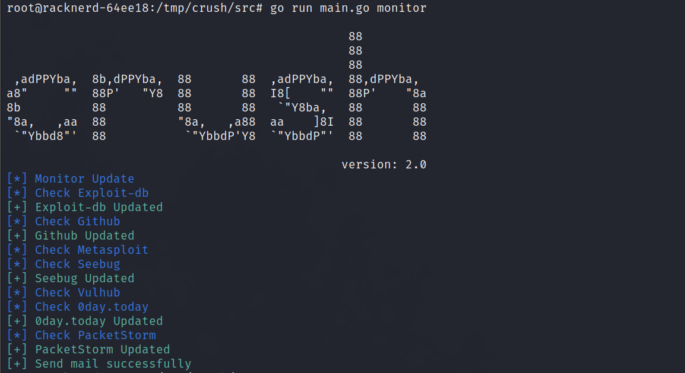
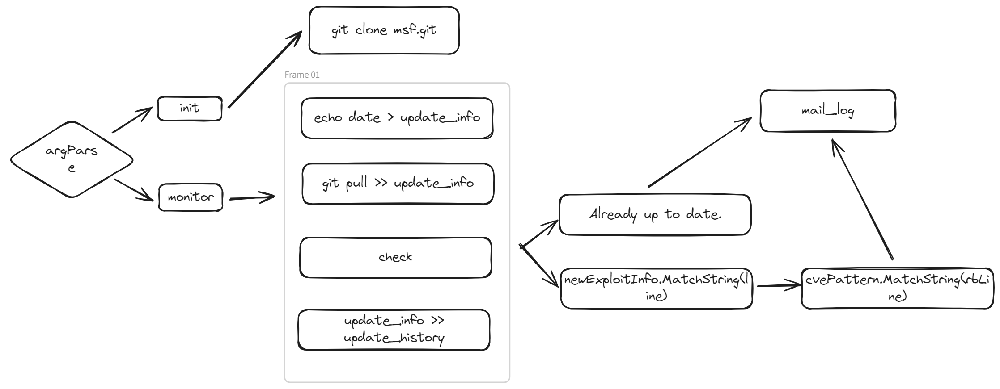
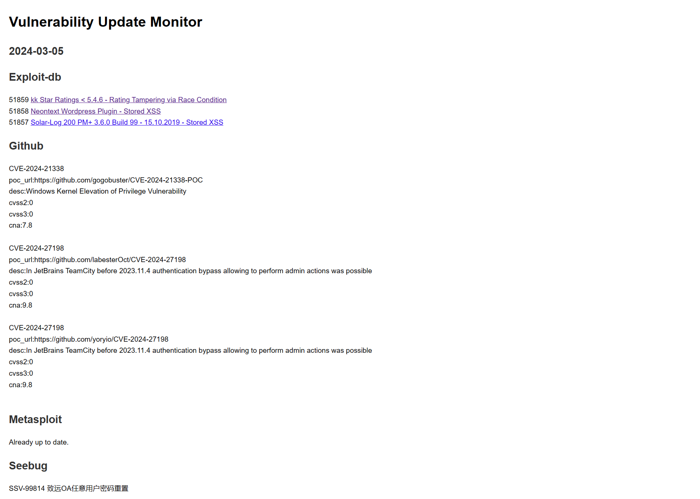
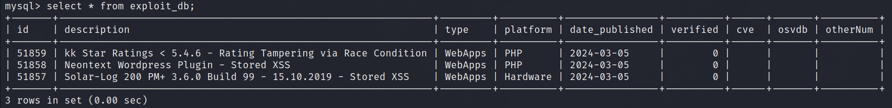
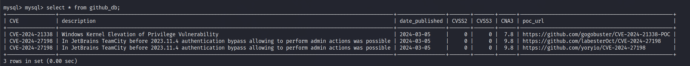
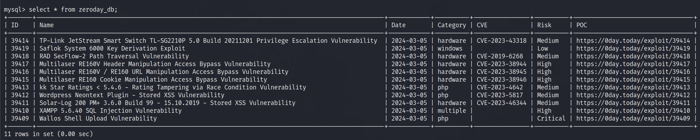
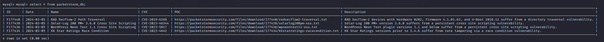

 

## CRUSH是一款漏洞监控工具，用来监控每日漏洞更新并通过邮件推送

```

                                                88
                                                88
                                                88
 ,adPPYba,  8b,dPPYba,  88       88  ,adPPYba,  88,dPPYba,
a8"     ""  88P'   "Y8  88       88  I8[    ""  88P'    "8a
8b          88          88       88   `"Y8ba,   88       88
"8a,   ,aa  88          "8a,   ,a88  aa    ]8I  88       88
 `"Ybbd8"'  88           `"YbbdP'Y8  `"YbbdP"'  88       88


```
## 🎯功能

监控多个漏洞平台每日更新，将数据存储到本地数据库，并通过邮件进行推送。

### 漏洞源

* [x] Exploit-db
* [x] Vulhub
* [x] Github
* [x] Seebug
* [x] Metasploit
* [x] 0day.today（V2.0新增）
* [x] PacketStorm（V2.0新增）

## 🪄安装

工具只能在linux上运行，建议为海外VPS，防止出现github等连接不通的情况。

### Go

- [Go](https://go.dev/) version 1.20 或以上版本.

**Github**

```bash
git clone https://github.com/leesinz/crush.git
cd crush/src
go build
./crush   or go run main.go
```

## 🔧配置

#### config.yaml

```yaml
database:
  db_port: 3306
  db_username: "root"
  db_password: "password"
  name: "db_name"

github:
  github_token: ghp_xxx
  blacklist:
    - aaa
    - bbb

msf:
  #the folder used for git pull msf
  msf_dir: "/root/vul_info/msf/"

vulhub:
  #the folder used for git pull vulhub
  vulhub_dir: "/root/vul_info/vulhub/"

email:
  smtp_server: smtp.163.com
  smtp_port: 25
  username: test@163.com
  #授权码，不是邮箱密码
  password: xxxxxxxx
  from: test@163.com
  to:
    - test1@xxx.com
    - test2@xxx.com

```

#### mysql配置

```
sudo apt-get update
sudo apt-get install mysql-server
sudo mysql_secure_installation
```

设置密码并创建数据库，将配置信息同步到config.yml。

如果遇到

`Error connecting mysql database:%!(EXTRA *mysql.MySQLError=Error 1698 (28000): Access denied for user 'root'@'localhost', string=)`

重置密码即可：

`ALTER USER 'root'@'localhost' IDENTIFIED WITH mysql_native_password BY 'newpasswd';`

#### 安装google-chrome

```bash
wget https://dl.google.com/linux/direct/google-chrome-stable_current_amd64.deb
sudo apt install ./google-chrome-stable_current_amd64.deb
```

显示版本号即为安装成功，如下：

```bash
root@iZt4ndirp1045jgp7cqswkZ:~# google-chrome -version
Google Chrome 121.0.6167.139
```

#### 快速开始

##### 环境配置

- go环境
- mysql环境
- config.yaml配置
- google-chrome配置

配置完成后即可开始使用。



#####  初始化

初次使用时，先使用 init 参数，进行数据库创建，msf&vulhub的本地git pull等操作。

`go run main.go init`



##### 更新监控

在完成初始化后，后续使用monitor参数监控更新即可，会通过邮件将更新内容进行推送。

`go run main.go monitor`



**crontab请自行配置，代码中未设置定时任务或循环等。**

例如：

`0 9 * * * cd /root/crush/src && /usr/local/go/bin/go run main.go monitor`

会在每天9点推送前一天的更新内容。

##### 导入历史数据（可选）

在V2.0版本中不再爬取历史数据，如果需要历史数据，可以直接通过.sql文件（存放在sql文件夹下）将历史数据导入数据库。

**exploit_db.sql,seebug_db.sql为全量历史数据，github_db.sql为2018至今的CVE数据，每个CVE最多五条。**

以exploit-db为例，命令如下：

`mysql -u username -p database_name < exploit_db.sql`

## 💡匹配逻辑

#### github


#### metasploit&vulhub



#### else

其他几个漏洞平台匹配逻辑类似，直接访问exploit页面，进行日期匹配，并且解析poc，cve等等信息写入数据库。

## 😎运行演示

#### 邮件模板



在V1.0的基础上新增了两个漏洞源，github部分格式保留，防止同一个CVE有多个不同POC时影响观感，其他数据源的漏洞名称加上了超链接，点击即可跳转到漏洞POC网站，更加方便。

#### 数据库结构

##### exploit-db

包含了edb官网存储的所有属性值：



##### github

存储了CVE编号，nvd官网的漏洞描述，CVSS2,CVSS3,CNA评分，更新时间以及poc地址：



##### seebug

存储了官网ID，提交时间，漏洞严重程度，漏洞名称，CVE号以及是否有POC：


##### 0day.today

存储了官网ID，漏洞名称，CVE号，POC地址等信息：



##### packetstorm

存储了官网ID，名称，CVE号，POC地址以及漏洞描述等等：



## 🎉鸣谢

感谢以下优秀的项目：

[github_cve_monitor](https://github.com/yhy0/github-cve-monitor)

## 🕵️免责声明

本工具仅能在取得足够合法授权的企业安全建设中使用，在使用本工具过程中，您应确保自己所有行为符合当地的法律法规。 
如您在使用本工具的过程中存在任何非法行为，您将自行承担所有后果，本工具所有开发者和所有贡献者不承担任何法律及连带责任。
除非您已充分阅读、完全理解并接受本协议所有条款，否则，请您不要安装并使用本工具。
您的使用行为或者您以其他任何明示或者默示方式表示接受本协议的，即视为您已阅读并同意本协议的约束。

## ⭐Star History

[](


